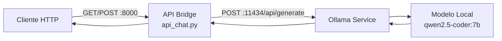

# MistralOllama API Bridge

API REST en Python que funciona como puente entre clientes HTTP y Ollama, permitiendo interactuar con modelos de lenguaje locales (como Qwen2.5-Coder, Mistral, etc.) a través de una interfaz simple.

## Arquitectura



## Endpoints

| Método | Ruta | Descripción |
|--------|------|-------------|
| `GET` | `/health` | Health check del servidor |
| `GET` | `/chat` | Respuesta de prueba (hello world) |
| `POST` | `/chat` | Envía un prompt al modelo local |

### Ejemplo POST /chat

```bash
curl -X POST http://localhost:8000/chat \
  -H "Content-Type: application/json" \
  -d '{"prompt": "Explica qué eres en una línea"}'
```

Respuesta:

```json
{
  "modelo": "qwen2.5-coder:7b",
  "prompt": "Explica qué eres en una línea",
  "respuesta": "Soy un asistente de IA ejecutándose localmente en Ollama.",
  "status": "ok"
}
```

## Requisitos

- **Python 3.12+**
- **Ollama** instalado y corriendo en `http://localhost:11434`
- Un modelo descargado en Ollama (ej. `qwen2.5-coder:7b`, `mistral`, `llama3`, etc.)

## Instalación y uso

```powershell
# 1. Clonar o descargar el proyecto
cd MistralOllama

# 2. Iniciar el servidor
python api_chat.py

# 3. Probar health check
curl http://localhost:8000/health
```

El servidor se levanta en `http://0.0.0.0:8000`.

## Scripts incluidos

| Script | Descripción |
|--------|-------------|
| `api_chat.py` | Servidor API principal |
| `instalar_ollama.ps1` | Instalación automatizada de Ollama |
| `configurar_firewall.ps1` | Abre puertos en firewall de Windows |
| `validar_ollama.ps1` | Suite de verificación del entorno |
| `fix_zerotier.ps1` | Soluciona problemas de conexión ZeroTier |

## Personalizar el modelo

Edita las variables al inicio de `api_chat.py`:

```python
OLLAMA_HOST = "http://localhost:11434"
MODELO = "qwen2.5-coder:7b"   # Cambia por el modelo que prefieras
PUERTO = 8000
```

## Licencia

MIT
