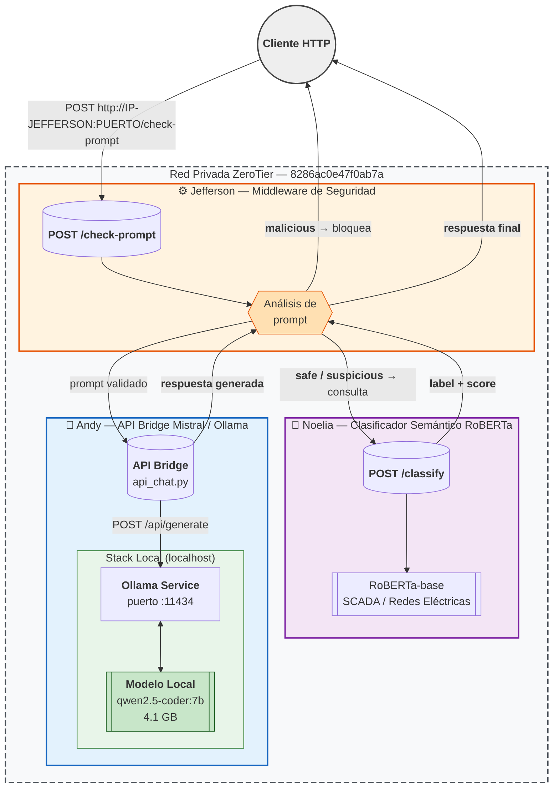

# Proyecto_Lagla

**Sistema distribuido de detección de prompts maliciosos para entornos SCADA y redes eléctricas.**

Arquitectura de microservicios interconectados via ZeroTier, compuesta por tres componentes principales: clasificador semántico (RoBERTa), middleware de seguridad y API bridge para modelo de lenguaje local (Ollama).

---

## Arquitectura del sistema



## Leyenda del diagrama

| Símbolo | Significado |
|---------|-------------|
| `( )` | Endpoint de entrada/salida (API) |
| `{ }` | Decisión / lógica condicional |
| `[[ ]]` | Modelo de IA / datos persistentes |
| `[ ]` | Servicio o proceso interno |
| Línea sólida | Flujo de datos principal |
| Línea discontinua | Límite de red ZeroTier |

---

## Flujo de una solicitud

```
CLIENTE                          MIDDLEWARE (Jeff)                  ROBERTA (Noelia)
   │                                      │                              │
   │  POST /check-prompt                  │                              │
   │  {"prompt": "..."}                  │                              │
   ├─────────────────────────────────────►│                              │
   │                                      │  POST /classify              │
   │                                      │  {"prompt": "..."}          │
   │                                      ├─────────────────────────────►│
   │                                      │                              │
   │                                      │◄─────────────────────────────┤
   │                                      │  {"label":"safe",            │
   │                                      │   "score":0.98}             │
   │                                      │                              │
   │                                      │  ─── si safe/suspicious ──  │
   │                                      │                              │
   │                                      │  POST /chat                  │
   │                                      │  {"prompt": "..."}          │
   │                                      ├──────────────────────┐       │
   │                                      │                      │       │
   │                                      │           ┌──────────▼────┐  │
   │                                      │           │ ANDY - Ollama │  │
   │                                      │           │ api_chat.py   │  │
   │                                      │           │ → qwen2.5     │  │
   │                                      │           └──────────┬────┘  │
   │                                      │                      │       │
   │                                      │◄─────────────────────┘       │
   │                                      │  {"respuesta":"...",         │
   │                                      │   "status":"ok"}            │
   │                                      │                              │
   │◄─────────────────────────────────────┤                              │
   │  {"respuesta":"...","clasificacion": │                              │
   │   "safe","status":"ok"}             │                              │
```

---

## Componente Andy: API Bridge Mistral / Ollama

API REST en Python puro (sin dependencias externas) que expone modelos de lenguaje locales a través de la red ZeroTier.

### Endpoints

| Método | Ruta | Descripción |
|--------|------|-------------|
| `GET` | `/health` | Health check del servidor |
| `GET` | `/chat` | Respuesta de prueba |
| `POST` | `/chat` | Envía un prompt al modelo local |

### Ejemplo POST /chat

```bash
curl -X POST http://localhost:8000/chat \
  -H "Content-Type: application/json" \
  -d '{"prompt": "Explica qué eres en una línea"}'
```

Respuesta:

```json
{
  "modelo": "qwen2.5-coder:7b",
  "prompt": "Explica qué eres en una línea",
  "respuesta": "Soy un asistente de IA ejecutándose localmente en Ollama.",
  "status": "ok"
}
```

### Stack tecnológico

| Componente | Tecnología |
|------------|-----------|
| Servidor HTTP | Python `http.server.ThreadingHTTPServer` |
| Backend LLM | Ollama 0.24.0 |
| Modelo | qwen2.5-coder:7b (Q8, 4.1 GB) |
| Red privada | ZeroTier 1.16.2 — Red: `8286ac0e47f0ab7a` |
| SO | Windows 11 Pro |

---

## Scripts incluidos

| Script | Descripción |
|--------|-------------|
| `api_chat.py` | Servidor API principal |
| `instalar_ollama.ps1` | Instalación automatizada de Ollama |
| `configurar_firewall.ps1` | Abre puertos en firewall de Windows |
| `validar_ollama.ps1` | Suite de verificación del entorno |
| `fix_zerotier.ps1` | Soluciona problemas de conexión ZeroTier |

---

## Personalizar el modelo

Edita las variables al inicio de `api_chat.py`:

```python
OLLAMA_HOST = "http://localhost:11434"
MODELO = "qwen2.5-coder:7b"   # Cambia por el modelo que prefieras
PUERTO = 8000
```

---

## Licencia

MIT
